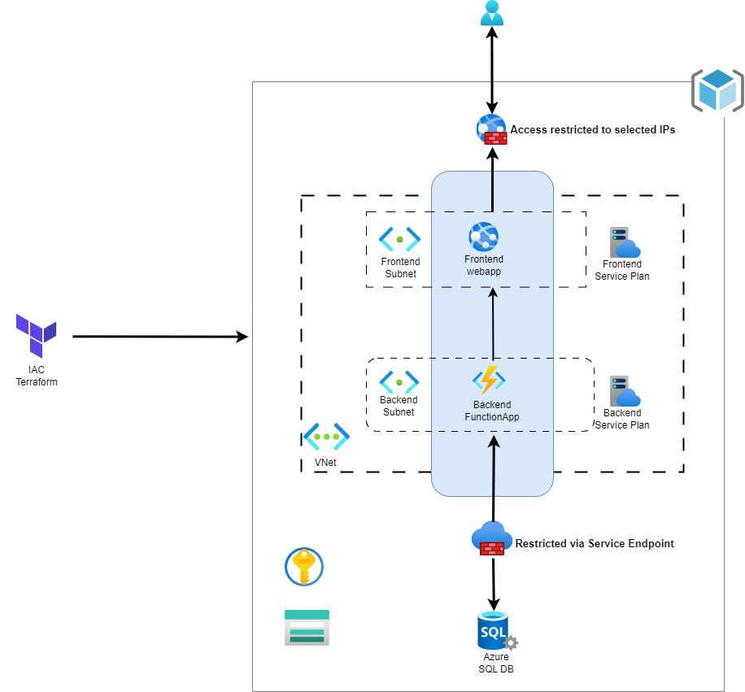

# Overview of the 3-Tier Architecture
This architecture represents a secure, scalable deployment for modern applications in Azure, consisting of Frontend (Presentation), Backend (Application Logic), and Database (Data) tiers, all integrated into a Virtual Network (VNet). It is provisioned using Terraform for infrastructure as code.

**1. Frontend Tier**\
Service: Azure App Service (Web App).\
Role: Serves the user interface of the application.\
VNet Integration: Deployed in the frontend-subnet of a shared VNet.
                  Integrated with the Microsoft.Web service endpoint, ensuring secure private communication with other Azure services.\
Access Control: Public access is restricted to specific IP ranges using App Service IP restrictions.\
Monitoring: Integrated with Application Insights for real-time performance and error monitoring. Logs are sent to a centralized Log Analytics Workspace.\

**2. Backend Tier**
Service: Azure Function App.
Role: Handles application logic and APIs for the frontend.
VNet Integration: Deployed in the backend-subnet of the same VNet.
                  Integrated with the Microsoft.Sql service endpoint, ensuring private communication with the database.
                  Uses service delegation to Microsoft.Web/serverFarms for secure subnet integration.
Data Storage: Leverages an Azure Storage Account for durable function execution and runtime data storage.
Monitoring: Connected to Application Insights for detailed telemetry.
            Logs are aggregated in the Log Analytics Workspace.

**3. Database Tier**
Service: Azure SQL Database.
Role: Stores application data securely.
Network Security: Connected privately through a Service Endpoint configured in the backend-subnet.
                Public access is disabled, ensuring all traffic to the database remains internal.
Secrets Management: Connection strings are securely stored and retrieved from Azure Key Vault.

## Terraform files Explained in Detail

**Provider**: - [Provider](https://github.com/harshitdevops/3-tier-iac-azure/blob/main/Terraform%20Files/providers.tf) - 
    Hashcorp minimum version 4.0.1. This file defines the Azure provider required for this project, using the azurerm provider version 4.0.1. It provisions a storage account and container to securely store Terraform's state file, ensuring that infrastructure changes are tracked. Additionally, the provider configuration includes a subscription ID, allowing Terraform to interact with Azure resources under the correct account.

**AppServicePlan** - [appserviceplan.tf](https://github.com/harshitdevops/3-tier-iac-azure/blob/main/Terraform%20Files/appserviceplan.tf) - 
      This file configures two separate Azure App Service Plans: one for the frontend and one for the backend. Both plans use a Linux OS and the "S1" SKU, which supports Availability Zones for scaling and redundancy. Dependencies are set to ensure that the app service plans are created only after the required subnets are provisioned.

**AzureWebsite** - [azurewebsite.tf](https://github.com/harshitdevops/3-tier-iac-azure/blob/main//Terraform%20Files/azurewebsite.tf) - 
      This file defines two primary resources: the frontend Linux web app and the backend Function App. The web app uses Node.js (version 20 LTS) and is secured by HTTPS-only traffic. It is also linked to Application Insights for monitoring. The backend Function App, built in Python (version 3.12), is secured by Virtual Network integration and restricts access to        the   frontend subnet. Both apps use system-assigned identities to access other Azure resources.

**Database** - [database.tf](https://github.com/harshitdevops/3-tier-iac-azure/blob/main//Terraform%20Files/database.tf)
      This file manages an Azure SQL Server and database. A random complex password is generated to ensure security. Additionally, a virtual network rule is created to restrict access to the backend subnet only. The file also creates a SQL database and defines its parameters, including size, collation, and environment tags.

**KeyVault** - [keyvault.tf](https://github.com/harshitdevops/3-tier-iac-azure/blob/main//Terraform%20Files/keyvault.tf)
      This file provisions an Azure Key Vault, enabling disk encryption and setting retention policies for deleted secrets. It configures access policies, granting specific users and applications permissions to access keys and secrets. Additionally, Key Vault logging is enabled using Azure Monitor Diagnostic Settings.

**Logging** - [logging.tf](https://github.com/harshitdevops/3-tier-iac-azure/blob/main//Terraform%20Files/logging.tf)
      This file creates an Azure Log Analytics workspace for storing diagnostic logs and Application Insights to monitor the performance of the frontend web app and backend Function App. Both resources enable detailed telemetry collection for analysis and diagnostics.
      
**Main** - [main.tf](https://github.com/harshitdevops/3-tier-iac-azure/blob/main//Terraform%20Files/main.tf)
      This file defines the Azure Resource Group where all other resources are provisioned. Tags are also added for environment and team categorization.

**Outputs** - [outputs.tf](https://github.com/harshitdevops/3-tier-iac-azure/blob/main//Terraform%20Files/outputs.tf)
      This file provides output values that are useful for interacting with the infrastructure. It outputs the resource group ID, the URLs for both the frontend and backend apps, and the Application Insights instrumentation key.
    
**Variables** - [variables.tf](https://github.com/harshitdevops/3-tier-iac-azure/blob/main//Terraform%20Files/variables.tf)
      This file declares variables used across other Terraform files, such as the resource_group_name and location. It allows for easy customization by centralizing configuration values.

**Vnet** - [vnet.tf](https://github.com/harshitdevops/3-tier-iac-azure/blob/main//Terraform%20Files/vnet.tf)
      This file creates an Azure Virtual Network and subnets for the frontend and backend. The subnets are configured with service endpoints, allowing secure communication between web services and the SQL database. Delegations for each subnet are defined to manage which services can connect to the subnets.

